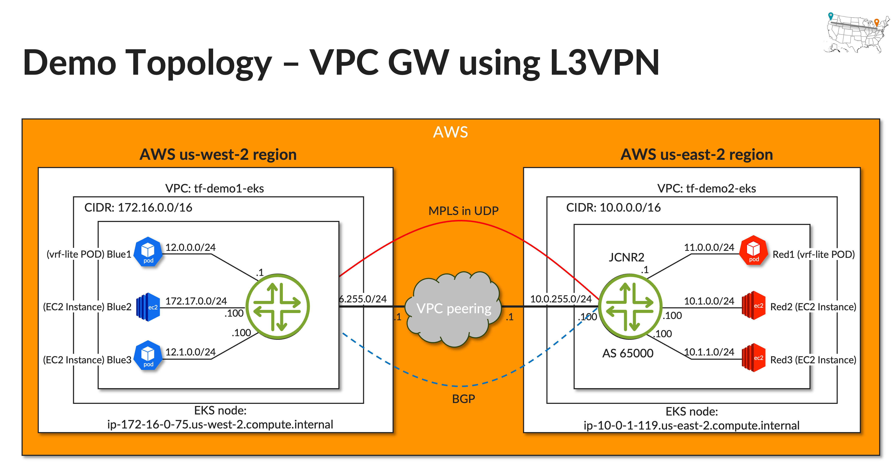
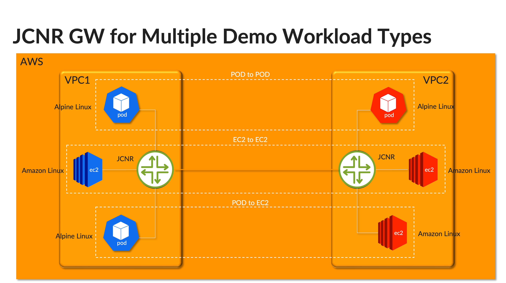

# AWS Demo Environment for Juniper Cloud-Native Router (JCNR)

This repository provides Terraform scripts and configuration files to set up a demo environment for the Juniper Cloud-Native Router (JCNR) on AWS. It sets up AWS resources and configures JCNR in both east and west VPCs.

<!-- START doctoc -->
<!-- END doctoc -->

## AWS Resources Created

- EKS cluster with a single worker node.
- VPC Peering between the VPCs.
- VPC and associated subnets.
- EC2 instances acting as L3VPN CE devices.
- Multus CNI driver for Kubernetes.
- EBS CSI driver for Kubernetes.
- DPDK environment setup DaemonSet in the worker node.
- SSH key-pair for accessing EC2 instances and the EKS node.
- Additional ENI interfaces on EKS node for JCNR data plane.

## Directory Structure

```
.
├── config-east/
│   ├── charts/           # JCNR Helm chart variables for the east VPC
│   ├── config/           # JCNR and workloads configuration for east VPC
│   └── tf/               # Terraform variables for east VPC
├── config-west/
│   ├── charts/           # JCNR Helm chart variables for the west VPC
│   ├── config/           # JCNR and workloads configuration for west VPC
│   └── tf/               # Terraform variables for west VPC
├── tf-aws/               # Terraform scripts for AWS resources
├── secrets/              # K8s secrets manifest for JCNR and setup script
└── install-tools.sh      # Script to install required tools
```

### Before start 
For a smooth deployment experience, we recommend utilizing two separate machines or virtual machines (VMs) as your setup environment. This ensures that there's no overlap or confusion between the two EKS clusters and their respective Terraform operations. While the guide is crafted for Ubuntu 22.04 as the primary setup machine, other Linux distributions such as CentOS or Rocky Linux should also be compatible. macOS users can adapt this guide, though there might be minor differences in some steps.

## Prerequisites

- Git installed on your setup machine.
- Basic knowledge of AWS, Kubernetes, and Terraform.


## Demo Topology
Network Topology


End-to-End Workload types



## Setup Guide

### 1. Clone the Repository

```bash
git clone https://github.com/simonrho/jcnr-in-aws-demo.git
cd jcnr-in-aws-demo
```

### 2. Install Necessary Tools

Run the provided script to install the required tools:

```bash
./install-tools.sh
```

### 3. AWS Configuration

Configure AWS CLI with your credentials:

```bash
aws configure
```

Ensure you provide the AWS accesskey, secretkey, region, and output format when prompted.

### 4. Terraform Initialization and Apply

Before running Terraform, copy the appropriate `variables.tf` file from the east/west config directory to the `tf-aws` directory, and then navigate to the `tf-aws` directory:


For the East VPC:

```bash
cp config-east/tf/variables.tf tf-aws/
```

For the West VPC:
```bash
cp config-west/tf/variables.tf tf-aws/
```

Now, switch to the tf-aws directory and initialize Terraform:
```bash
cd tf-aws/
terraform init

```

Apply the Terraform configurations:
```bash
terraform apply
```

### 5. Labeling EKS Worker Node 

The JCNR deployment targets EKS worker nodes with a specific label. You can manually add this label using the following command:

```bash
kubectl label nodes $(kubectl get nodes -o json | jq -r .items[0].metadata.name) key1=jcnr --overwrite
```

**Note**: Once you add this label, which matches the dpdk env setup label key, the EKS node will reboot to apply the huge page setup. Please wait a few minutes for the node to come back up before proceeding with the next steps.


### Optional: Using `setup.sh` under `secrets` directroy for Automated Setup
For an effortless setup of JCNR secrets, including the license and root password, as well as adding the necessary label to the EKS worker node, you can make use of a provided setup script.

Navigate to the secrets directory:
```bash
cd ~/demo/secrets
```

To run the script and set up the necessary configurations:

```bash
cd ./secrets
./setup.sh
```

This script will apply the JCNR secrets and add the `key1=jcnr` label to your EKS worker nodes.

**NOTE:** A daemonset service (`dpdk-env-setup`) is installed during the Terraform setup to prepare the DPDK running environment for JCNR. This service targets specific worker nodes with a particular tag/label. You can customize this in the Terraform code. The tag/label value is also used for JCNR helm chart installation, located in the `values.yaml` within the JCNR helm charts.

For sample JCNR Junos configurations and workload configurations, refer to the config directories under config-east and config-west directory.


### 6. Setting up JCNR Secrets

Before you proceed with the installation of JCNR, it's crucial to configure the `jcnr-secrets.yaml` with the required credentials.

#### Configure `jcnr-secrets.yaml`

Enter the root password for your host server and your Juniper Cloud-Native Router license file into the `secrets/jcnr-secrets.yaml` file.

You can view the sample contents of the `jcnr-secrets.yaml` file below:

```yaml
---
apiVersion: v1
kind: Namespace
metadata:
  name: jcnr
---
apiVersion: v1
kind: Secret
metadata:
  name: jcnr-secrets
  namespace: jcnr
data:
  root-password: <add your password in base64 format>
  crpd-license: |
    <add your license in base64 format>
```

Encode the password and license in base64:

1. To encode the password, create a file with only the plain text password:

```bash
echo "YourPlainTextPassword" > rootPasswordFile
base64 -w 0 rootPasswordFile
```

2. To encode the license file, issue the following command:

```bash
base64 -w 0 licenseFile
```

Copy the base64 outputs and paste them into the `secrets/jcnr-secrets.yaml` file at the respective places.

Apply the secrets to Kubernetes:

```bash
kubectl apply -f secrets/jcnr-secrets.yaml
```

**NOTE:** Make sure you have obtained your license file from your account team and installed it in the `secrets.yaml` file as instructed above. Without the proper base64-encoded license file and root password in the `secrets.yaml` file, the cRPD Pod will remain in `CrashLoopBackOff` state.


### 7. Helm Setup for JCNR

First, ensure that you are authenticated with AWS. Helm will use your AWS credentials to pull the JCNR helm charts from the AWS Marketplace.

Login to your AWS account via Helm:

```bash
export HELM_EXPERIMENTAL_OCI=1

aws ecr get-login-password \
    --region us-east-1 | helm registry login \
    --username AWS \
    --password-stdin 709825985650.dkr.ecr.us-east-1.amazonaws.com
```

Now, pull and untar the JCNR helm charts:

```bash
helm pull oci://709825985650.dkr.ecr.us-east-1.amazonaws.com/juniper-networks/jcnr --version 23.2.0
```

Untar the JCNR helm charts tar file:
```bash
tar zxvf jcnr-23.2.0.tgz 
```


After successfully creating all AWS resources, install the JCNR with the helm charts downloaded from the AWS marketplace.


### 8. Install JCNR with Helm

After successfully creating all AWS resources, install the JCNR with the helm charts downloaded from the AWS marketplace.

Use the `values.yaml` and `jcnr-secrets.yaml` from the appropriate charts directory of `config-east/charts` or `config-west/charts`.

Now, switch to the jcnr directory and install jcnr:

For the East VPC:

```bash
cd jcnr
cp ../config-east/charts/values.yaml ./values.yaml
```

For the West VPC:

```bash
cd jcnr
cp ../config-west/charts/values.yaml ./values.yaml
```

After setting the correct values, you can proceed with the JCNR installation using Helm:

```bash
helm install jcnr .
```
Wait for a few minutes for the JCNR pods and services to be deployed. Once done, you can check the status using:

```bash
helm ls
kubectl get pods -n jcnr
kubectl get pods -n contrail
```

### 9. Cleanup or Teardown
To safely remove all AWS resources and the JCNR deployment:

```bash
cd tf-aws/
terraform destroy
```